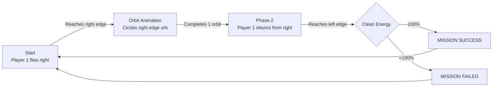

# Ko0808/p5Projection Repository Investigation Report

> **Investigation Date**: March 13, 2026, 17:50 (Local Time)  
> **Target Repository**: https://github.com/Ko0808/p5Projection.git  
> **Local Path**: `c:\Users\koupe\Documents\Taylors\Bachelor\LightingInteractive\LightingFinal`

---

## 1. Project Overview

This is an interactive 2-player game titled **"ISD 60504 - SPATIAL COMBAT"**, presumably developed as an academic assignment (Bachelor, Taylor's University).

### Game Content
- **Player 1 (Left Half)**: Controls a rocket using **hand movements (hand tracking)** captured by a webcam, aiming for outer space on the right edge.
- **Player 2 (Right Half)**: Moves a UFO-shaped ship up and down using hand movements, firing lasers to attack/hinder Player 1.
- **Game Objective**: Player 1 must collect clean energy orbs and return to the left edge with 100% collected to achieve "MISSION SUCCESS".

### Technology Stack
| Technology | Purpose |
|------|------|
| **p5.js** | Graphics rendering, physics calculations, game loop |
| **ml5.js (HandPose)** | Real-time hand recognition via webcam |
| **p5.sound** | Background music (BGM) and sound effects (SE) management |
| HTML5 Canvas | Rendering foundation |

---

## 2. File Structure

```
LightingFinal/
├── index.html              # Entry point (Loads p5.js, ml5.js, and other scripts)
├── sketch_260227b.js       # Main game logic (750 lines) ★
├── Player2.js              # Player 2 / Enemy classes (222 lines)
├── SoundEffect/
│   ├── bgm.mp3             # Background music (ca. 1MB)
│   ├── explosion.mp3       # Explosion SE
│   └── lazer.mp3           # Laser SE
├── libraries/
│   └── p5.min.js           # Core p5.js library
├── Player_2_Code/          # Initial Player 2 prototype (for reference)
└── index/                  # Alternative index version (saved during week 6)
```

---

## 3. Detailed Commit History (19 Commits)

Development occurred over roughly two weeks from **February 27 to March 13, 2026**, with **almost all activity concentrated on March 13 (a single day)**.

### Phase 1: Initial Setup (Prior to March 6)

| # | Commit | Date | Description |
|---|---------|------|------|
| 1 | `f77a6ac` Initial commit | 2026-02-27 | Initial registration of `index.html`, `sketch_260227b.js` (222 lines), and `p5.min.js`. Prototype of rocket control via hand tracking. |
| 2 | `7768014` add player2 | 2026-03-06 | Added `Player2.js` (69 lines) and `Player_2_Code` folder. Integrated Player 2 mouse control prototype. |
| 3 | `06e09b5` Merge PR #1 (TwoPlayer) | 2026-03-06 | Merged TwoPlayer branch into main. |

#### Initial Commit Sketch
- Wrist position used as a virtual joystick.
- Distance between index finger and thumb controls thrust (propulsion active if > 40px).
- Hand recognition powered by ml5.handPose.

---

### Phase 2: WEEK6 Save of 2Player + Hand Control Integration (Morning of March 13)

| # | Commit | Date | Description |
|---|---------|------|------|
| 4 | `dce4554` week6Saved | 2026-03-13 09:00 | Added `index/index.html` and `index/libraries/p5.min.js` (saving an alternative version). |
| 5 | `c5a16c8` add Two player with hand control | 2026-03-13 09:30 | **Full integration of 2-player hand control** for both hands. Expanded Player2.js to 85 lines, added 98 lines to main script. Screen divided into left/right, automatically assigning hands detected on each side. |
| 6 | `b804ca4` add some se | 2026-03-13 09:46 | Added BGM (`bgm.mp3`), explosion SE, and laser SE. Updated index.html to load ml5.js and sound libraries. |
| 7 | `9947d34` change lazer control logic | 2026-03-13 10:04 | Changed laser firing logic (added 43 lines to Player2.js). Fired by a "pinch" gesture (index+thumb distance < 40px). |
| 8 | `9db545f` UFO control UpDown | 2026-03-13 10:25 | Restricted Player 2's UFO movement to up/down only. Simplified from complex controls to ensure stable operability. |
| 9 | `765823f` Merge PR #2 (TwoPlayer) | 2026-03-13 | Merged TwoPlayer branch into main. |

---

### Phase 3: Scene and Game Flow Implementation (Midday to Afternoon, March 13)

| # | Commit | Date | Description |
|---|---------|------|------|
| 10 | `14480e1` add moon and earth | 2026-03-13 10:43 | Added moon and earth decorative objects at both ends of the screen. |
| 11 | `3e73f16` change scene logic | 2026-03-13 11:04 | **Largest change (+164 lines)**. Implemented 2-phase scene switching logic. Controls transition from space to return journey using the `isFlipped` flag. Initiates orbit animation when Player 1 reaches the right edge. |
| 12 | `b71a4bf` modify animation and recovery logic | 2026-03-13 11:24 | Adjusted orbit animation and HP recovery logic (-35 lines / +26 lines). |
| 13 | `11f6a3d` Merge PR #3 (scenes) | 2026-03-13 | Merged scenes branch into main. |
| 14 | `639b75f` dinamic speed system | 2026-03-13 13:18 | **Dynamic speed system**. Top speed scales with HP: `MAX_SPEED = 2 * max(0.1, p1Health / 100)`. |
| 15 | `f084838` ver2.0 | 2026-03-13 13:28 | Bug fixes and overall refactoring (+21 lines / -9 lines). |

---

### Phase 4: UI, Effects, and Mission Conditions Implementation (Afternoon, March 13)

| # | Commit | Date | Description |
|---|---------|------|------|
| 16 | `6d760ef` Add UI and Effect | 2026-03-13 14:05 | **Massive addition (+441 lines)**. Implemented HUD panels, starfield, screen shake, particle explosions, and energy orb collection system in one go. |
| 17 | `f703991` Merge PR #4 (UI) | 2026-03-13 | Merged UI branch into main. |
| 18 | `3a65ecc` modify clean energy system | 2026-03-13 14:39 | Adjusted clean energy collection system (+57 lines / -35 lines). Established logic to determine MISSION SUCCESS / FAILED upon return. |
| 19 | `066833f` Merge PR #5 (UI) | 2026-03-13 | Merged UI branch into main. |

---

### Phase 5: Control Improvements (Evening, March 13)

| # | Commit | Date | Description |
|---|---------|------|------|
| 20 | `1eb1d1b` joy stick control to rocket | 2026-03-13 15:06 | **Changed to joystick method (+42 lines / -20 lines)**. Instead of palm rotation, wrist position acts as a virtual joystick to determine rocket angle. |
| 21 | `61bf772` Merge PR #6 (rocketControl) | 2026-03-13 | Merged rocketControl branch into main. |

---

## 4. Game System Details

### Player 1 (Rocket) Controls
```
Wrist position → Angle calculated based on virtual joystick tilt
Index & thumb distance > 40px → Thrust (propulsion) generated
Dynamic top speed: MAX_SPEED = 2.0 × (HP / 100)
Friction: 0.95 (decelerates every frame)
```

### Game Flow (2 Phases)



### Collision and Damage System
| Event | Damage |
|---------|--------|
| Contact with meteorite | -15 HP |
| Direct laser hit | -10 HP |
| Laser detonates energy orb (close range) | -30 HP |
| 0 HP | Instant death & respawn (HP/Energy reset) |

---

## 5. Player2.js Class Structure

| Class | Role |
|--------|------|
| `Player2Ship` | UFO-shaped ship. Fastened to wrist Y-coordinate for vertical movement, pinch gesture to fire laser. |
| `Laser` | Player 2's projectiles. Fast horizontal movement (speedX = ±15). |
| `Meteorite` | Enemy: Meteorites of random sizes approaching from the side. |
| `EnergyOrb` | Collectible item: Clean energy orb swaying with a sine wave. |
| `Particle` | Particles for explosion effects. |

---

## 6. Summary and Project Evolution

```
[2/27] Initial prototype → Single-player rocket steering
  ↓
[3/6]  Player 2 integration → Transitions to 2-player co-op/versus game
  ↓
[3/13 AM] Hand controls integrated, SE added, UFO controls established
  ↓
[3/13 AM-PM] Scene switching, orbit animations, dynamic speed implemented
  ↓
[3/13 PM] Massive UI update, energy collection, mission results
  ↓
[3/13 Evening] Rocket control refined to joystick method (final version)
```

**Development Characteristics**: Highly concentrated sprint development where **the vast majority of the work was completed in a single day (March 13, 2026)**. Adopted a feature-task-driven flow managed via 6 Pull Requests. The presence of comments in both Japanese and simplified Chinese suggests an international development style.
