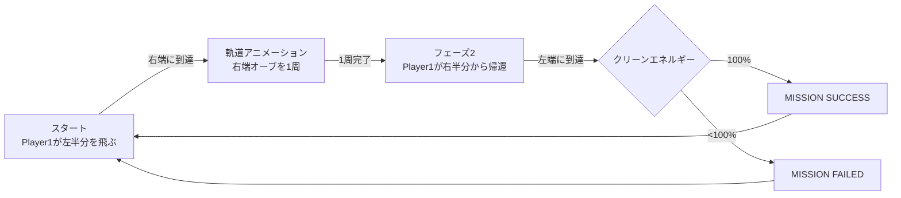

# Ko0808/p5Projection リポジトリ調査レポート

> **調査日時**: 2026年3月13日 17:50（現地時間）  
> **対象リポジトリ**: https://github.com/Ko0808/p5Projection.git  
> **ローカルパス**: `c:\Users\koupe\Documents\Taylors\Bachelor\LightingInteractive\LightingFinal`

---

## 1. プロジェクト概要

**「ISD 60504 - SPATIAL COMBAT」** というタイトルのインタラクティブ2Playerゲームで、大学の学科課題（Bachelor, Taylors大学）として開発されたと推測される。

### ゲームの内容
- **Player 1（左半分）**: Webカメラに映した**手の動き（ハンドトラッキング）** でロケットを操縦し、右端の宇宙空間を目指す
- **Player 2（右半分）**: 手の動きでUFO型の艦を上下に動かし、レーザーを発射してPlayer 1を攻撃/妨害する
- **ゲームの目的**: Player 1がクリーンエネルギーオーブを収集し、100%集めた状態で左端に帰還すれば「MISSION SUCCESS」

### 技術スタック
| 技術 | 用途 |
|------|------|
| **p5.js** | グラフィクス描画・物理演算・ゲームループ |
| **ml5.js (HandPose)** | Webカメラによるリアルタイム手認識 |
| **p5.sound** | BGM・SEの再生管理 |
| HTML5 Canvas | レンダリング基盤 |

---

## 2. ファイル構成

```
LightingFinal/
├── index.html              # エントリーポイント（p5.js, ml5.js, 各スクリプトを読み込み）
├── sketch_260227b.js       # メインゲームロジック（750行）★
├── Player2.js              # Player 2 / 敵クラス群（222行）
├── SoundEffect/
│   ├── bgm.mp3             # バックグラウンドミュージック（約1MB）
│   ├── explosion.mp3       # 爆発SE
│   └── lazer.mp3           # レーザーSE
├── libraries/
│   └── p5.min.js           # p5.js ライブラリ本体
├── Player_2_Code/          # Player 2 の初期プロトタイプ（参照用）
└── index/                  # 別バージョンのindex（week6保存用）
```

---

## 3. コミット履歴詳細（全19件）

開発は **2026年2月27日〜3月13日** の約2週間で行われ、**ほぼすべてが2026年3月13日（1日）** に集中している。

### フェーズ 1: 初期立ち上げ（3月6日以前）

| # | コミット | 日付 | 内容 |
|---|---------|------|------|
| 1 | `f77a6ac` Initial commit | 2026-02-27 | `index.html`, `sketch_260227b.js`(222行), `p5.min.js`の初期登録。ハンドトラッキングによるロケット操縦のプロトタイプ |
| 2 | `7768014` add player2 | 2026-03-06 | `Player2.js`(69行)、`Player_2_Code`フォルダを追加。Player 2のマウス操作プロトタイプを取り込み |
| 3 | `06e09b5` Merge PR #1 (TwoPlayer) | 2026-03-06 | TwoPlayerブランチをmainにマージ |

#### Initial commitのスケッチ
- 手首の位置を仮想ジョイスティックとして使用
- 人差し指と親指の間隔でスラスト制御（40px以上で推進）
- ml5.handPoseによる手認識

---

### フェーズ 2: 2PlayerのWEEK6保存 + 手制御統合（3月13日午前）

| # | コミット | 日付 | 内容 |
|---|---------|------|------|
| 4 | `dce4554` week6Saved | 2026-03-13 09:00 | `index/index.html`と`index/libraries/p5.min.js`を追加（別バージョン保存） |
| 5 | `c5a16c8` add Two player with hand control | 2026-03-13 09:30 | **両手での2Player手制御を本格統合**。Player2.jsを85行に拡張、メインスクリプトも98行追加。画面を左右に分割し、左/右に映った手を自動割り当て |
| 6 | `b804ca4` add some se | 2026-03-13 09:46 | BGM(`bgm.mp3`)・爆発音・レーザー音を追加。index.htmlにml5.jsとサウンドライブラリを追記 |
| 7 | `9947d34` change lazer control logic | 2026-03-13 10:04 | レーザーの発射制御ロジックを変更（Player2.js 43行追加）。指の「つまみ」ジェスチャー（index+thumb距離<40px）で発射 |
| 8 | `9db545f` UFO control UpDown | 2026-03-13 10:25 | Player 2のUFOを上下動のみに制限。複雑な制御から安定した操作性へ簡略化 |
| 9 | `765823f` Merge PR #2 (TwoPlayer) | 2026-03-13 | TwoPlayerブランチをmainにマージ |

---

### フェーズ 3: シーン・ゲームフロー実装（3月13日午前〜昼）

| # | コミット | 日付 | 内容 |
|---|---------|------|------|
| 10 | `14480e1` add moon and earth | 2026-03-13 10:43 | 画面両端に月・地球の装飾オブジェを追加 |
| 11 | `3e73f16` change scene logic | 2026-03-13 11:04 | **最大の変更（+164行）**。2フェーズのシーン切り替えロジックを実装。`isFlipped`フラグで宇宙→帰還を制御。Player1が右端に到達すると軌道アニメーション開始 |
| 12 | `b71a4bf` modify animation and recovery logic | 2026-03-13 11:24 | 軌道アニメーション・HP回復ロジックを調整（35行削除・26行追加） |
| 13 | `11f6a3d` Merge PR #3 (scenes) | 2026-03-13 | scenesブランチをmainにマージ |
| 14 | `639b75f` dinamic speed system | 2026-03-13 13:18 | **動的速度システム**。`MAX_SPEED = 2 * max(0.1, p1Health / 100)` でHPに比例して最高速度が変化 |
| 15 | `f084838` ver2.0 | 2026-03-13 13:28 | バグ修正・全体的なリファクタリング（21行追加/9行削除） |

---

### フェーズ 4: UI・演出・ミッション条件の実装（3月13日午後）

| # | コミット | 日付 | 内容 |
|---|---------|------|------|
| 16 | `6d760ef` Add UI and Effect | 2026-03-13 14:05 | **最大規模の追加（+441行）**。HUDパネル・星フィールド・スクリーンシェイク・パーティクル爆発・エネルギーオーブ収集システムを一括実装 |
| 17 | `f703991` Merge PR #4 (UI) | 2026-03-13 | UIブランチをmainにマージ |
| 18 | `3a65ecc` modify clean energy system | 2026-03-13 14:39 | クリーンエネルギーの収集システムを調整（57行追加/35行削除）。帰還時にMISSION SUCCESS / FAILEDを判定するロジックを確立 |
| 19 | `066833f` Merge PR #5 (UI) | 2026-03-13 | UIブランチをmainにマージ |

---

### フェーズ 5: コントロール改善（3月13日夕方）

| # | コミット | 日付 | 内容 |
|---|---------|------|------|
| 20 | `1eb1d1b` joy stick control to rocket | 2026-03-13 15:06 | **ジョイスティック方式への変更（42行追加/20行削除）**。手のひらの回転ではなく、手首の位置を仮想ジョイスティックとして使いロケット角度を制御 |
| 21 | `61bf772` Merge PR #6 (rocketControl) | 2026-03-13 | rocketControlブランチをmainにマージ |

---

## 4. ゲームシステムの詳細

### Player 1 (ロケット) の制御
```
手首位置 → 仮想ジョイスティックの傾きとして角度計算
人差し指〜親指の距離 >40px → スラスト（推進力）発生
動的最高速度: MAX_SPEED = 2.0 × (HP / 100)
摩擦: 0.95（毎フレーム減速）
```

### ゲームフロー（2フェーズ）



### 衝突・ダメージシステム
| イベント | ダメージ |
|---------|--------|
| 隕石との接触 | -15 HP |
| レーザー直撃 | -10 HP |
| レーザーがエネルギーオーブを爆発（近距離） | -30 HP |
| HP0 | 即死・リスポーン（HP・エネルギー初期化） |

---

## 5. Player2.jsのクラス構成

| クラス | 役割 |
|--------|------|
| `Player2Ship` | UFO型の艦。手首Y座標で上下移動、つまみジェスチャーでレーザー発射 |
| `Laser` | Player 2の弾。水平方向に高速移動（speedX=±15） |
| `Meteorite` | 敵：ランダムな大きさで横方向から飛来する隕石 |
| `EnergyOrb` | 収集アイテム：正弦波でゆらゆら動くクリーンエネルギーオーブ |
| `Particle` | 爆発演出用パーティクル |

---

## 6. まとめ・プロジェクトの変遷

```
[2/27] 初期プロトタイプ → 1人用ロケット操縦
  ↓
[3/6]  Player 2統合 → 2人協力/対戦ゲームへ
  ↓
[3/13 AM] 手制御統合・SE追加・UFO制御確立
  ↓
[3/13 AM-PM] シーン切り替え・軌道アニメーション・動的速度実装
  ↓
[3/13 PM] 大規模UI実装・エネルギー収集・ミッション結果
  ↓
[3/13 夕] ロケット操作をジョイスティック方式に改善（最終版）
```

**開発の特徴**: 実質的に **2026年3月13日1日で大部分が開発** された、非常に集中的なスプリント開発。6つのPull Requestを使ったブランチ管理で機能タスク型の開発フローを採用。コメントに日本語・中国語（简体字）の両方が混在しており、国際的な開発スタイルが見られる。

